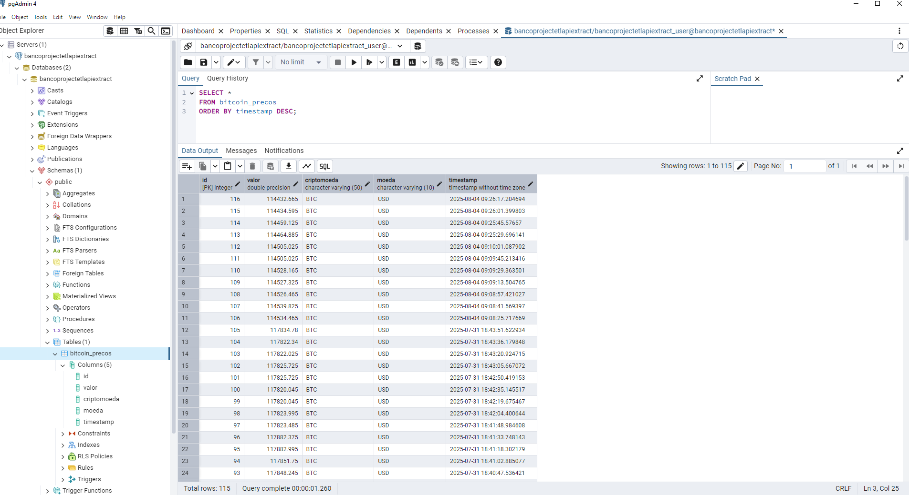
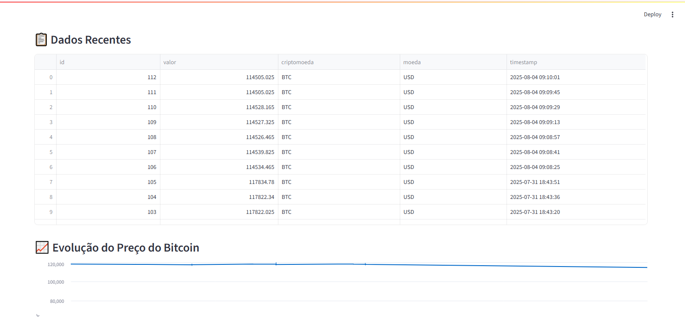
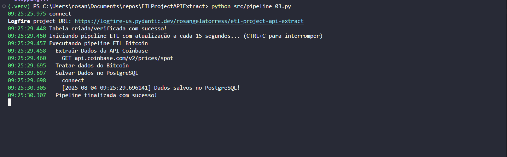

# Projeto ETL: Extração de Dados da API Coinbase com Visualização em Tempo Real

## Sobre o Projeto

Este projeto tem como objetivo demonstrar o ciclo completo de um pipeline de Engenharia de Dados, desde a extração de dados via API até a visualização interativa em um dashboard. Os dados utilizados representam o preço do Bitcoin em tempo real, obtidos a partir da API da Coinbase.

O pipeline é executado em tempo quase real, com atualização a cada 15 segundos, salvando os dados em um banco PostgreSQL e disponibilizando-os em um dashboard feito com Streamlit.

## Arquitetura da Solução

Este projeto segue o seguinte fluxo de dados:


## Funcionalidades

* Extração de dados da API da Coinbase
* Conversão e tratamento dos dados extraídos
* Salvamento dos dados em banco PostgreSQL
* Dashboard interativo em Streamlit com dados em tempo real

## Tecnologias Utilizadas

* Python 3
* PostgreSQL
* SQLAlchemy
* Requests
* dotenv
* Logfire (monitoramento e logs)
* Streamlit
* TinyDB

> Consulte o arquivo `requirements.txt` para ver todas as dependências utilizadas.

## Estrutura do Pipeline

### 1. Extração

Função: `extract_dados_bitcoin()`

* Requisição HTTP para a API Coinbase
* Conversão da resposta em JSON (Python dict)

### 2. Transformação

Função: `transform_dados_bitcoin()`

* Conversão do valor para `float`
* Adição de timestamp
* Estrutura final: `{"valor": float, "criptomoeda": str, "moeda": str, "timestamp": datetime}`

### 3. Carga

Função: `salvar_dados_postgres()`

* Cria novo registro no banco PostgreSQL usando SQLAlchemy

### Orquestração

A função `pipeline_bitcoin()` executa todas as etapas acima sequencialmente, a cada 15 segundos.

## 📁 Como Executar o Projeto Localmente

### 1. Clonar o Repositório

```bash
git clone https://github.com/rosangelatorress/ETLProjectAPIExtract.git
cd ETLProjectAPIExtract
```

### 2. Criar Ambiente Virtual

```bash
python -m venv .venv
.venv\Scripts\activate  # Windows
```

### 3. Criar o Arquivo `.env`

```env
POSTGRES_USER="<SEU_USUARIO>"
POSTGRES_PASSWORD="<SUA_SENHA>"
POSTGRES_HOST="<SEU_HOST>"
POSTGRES_PORT="<PORTA>"
POSTGRES_DB="<BANCO>"
LOGFIRE_TOKEN="<TOKEN>"
```

### 4. Instalar as Dependências

```bash
pip install -r requirements.txt
```

### 5. Autenticar Logfire

```bash
logfire auth
```

### 6. Executar a Pipeline

```bash
python src/pipeline_03.py
```

### 7. Executar o Dashboard

Abra outro terminal:

```bash
streamlit run app/dashboard_01.py
```

> ⚠️ A pipeline deve estar rodando antes de abrir o dashboard.

## 📊 Resultado Final

* Banco de dados atualizado com histórico do preço do Bitcoin a cada 15 segundos
* Dashboard Streamlit com:

  * Gráfico de linha do preço do Bitcoin
  * Métricas: valor atual, máximo e mínimo

  ### Dados no Banco (PostgreSQL)

A tabela no PostgreSQL é atualizada com registros do preço do Bitcoin a cada 15 segundos.

  

  ### Dashboard Interativo

  Gráfico de linha do preço do Bitcoin em tempo real, com métricas de valor atual, máximo e mínimo.

  

  ### Logs da Pipeline

  A pipeline é executada diretamente via terminal.

  


## 🎓 Aprendizados

Esse foi meu primeiro projeto completo de Engenharia de Dados. Foi muito gratificante ver na prática conceitos que antes só conhecia na teoria. Desenvolver esse pipeline me ajudou a entender o fluxo real de um projeto de ETL.

## Possíveis Melhorias Futuras

* Armazenamento histórico em data lake
* Adição de alertas via Telegram ou e-mail
* Coleta de outras criptomoedas

## 📅 Status do Projeto

Concluído ✅

## 👩‍🚀 Autora

Rosangela Torres
[GitHub](https://github.com/rosangelatorress)

---

> Projeto desenvolvido como parte da minha jornada para me tornar Engenheira de Dados.
